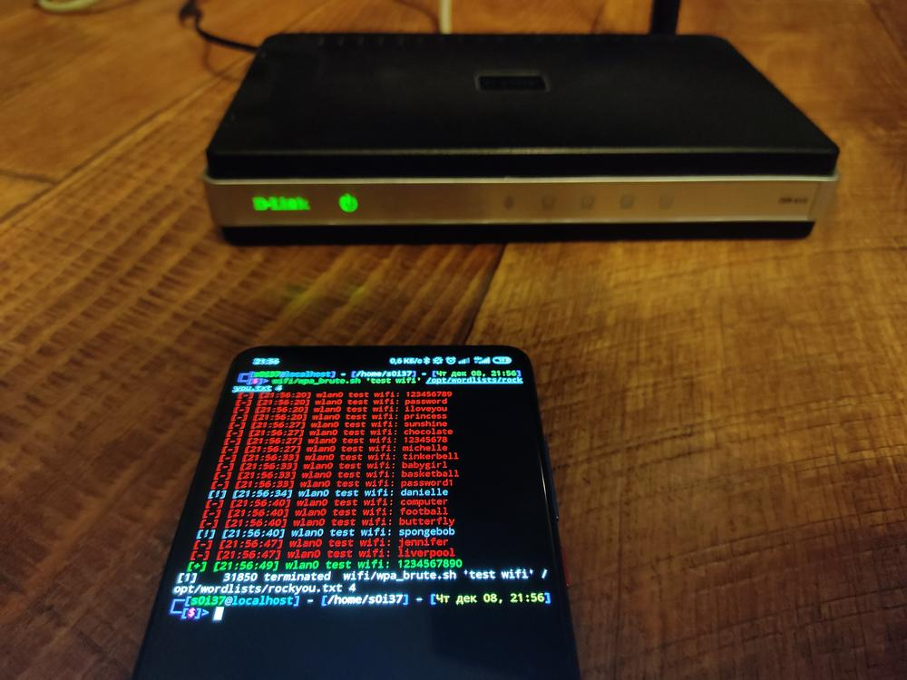
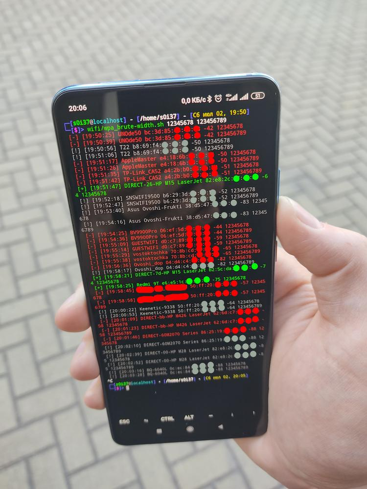
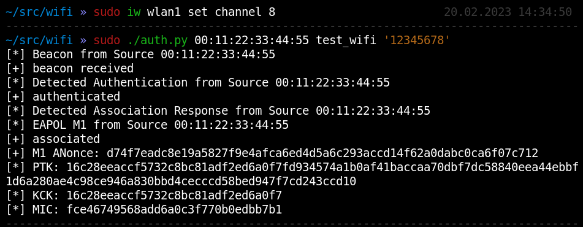
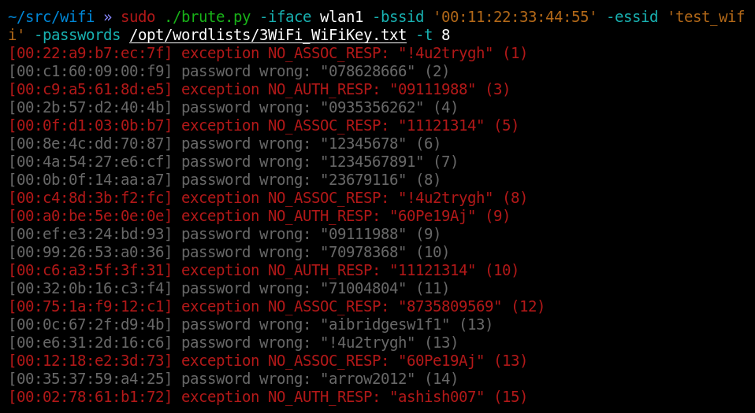
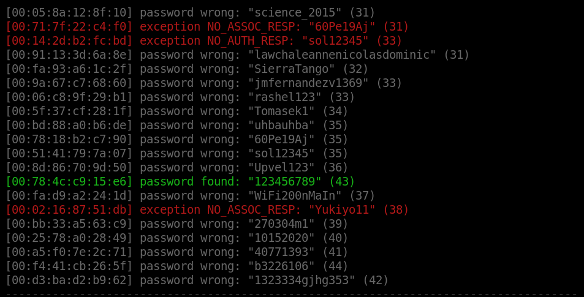
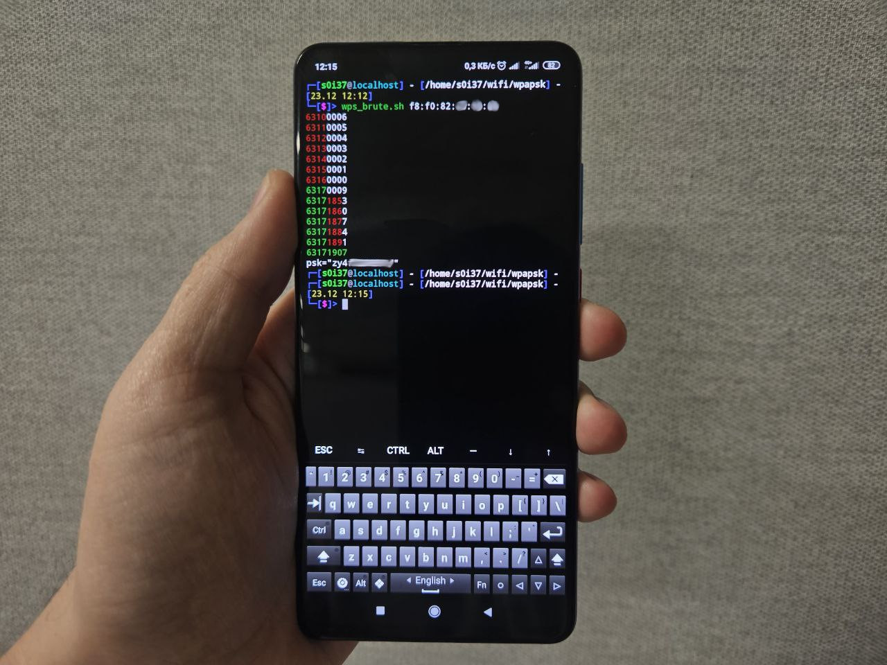
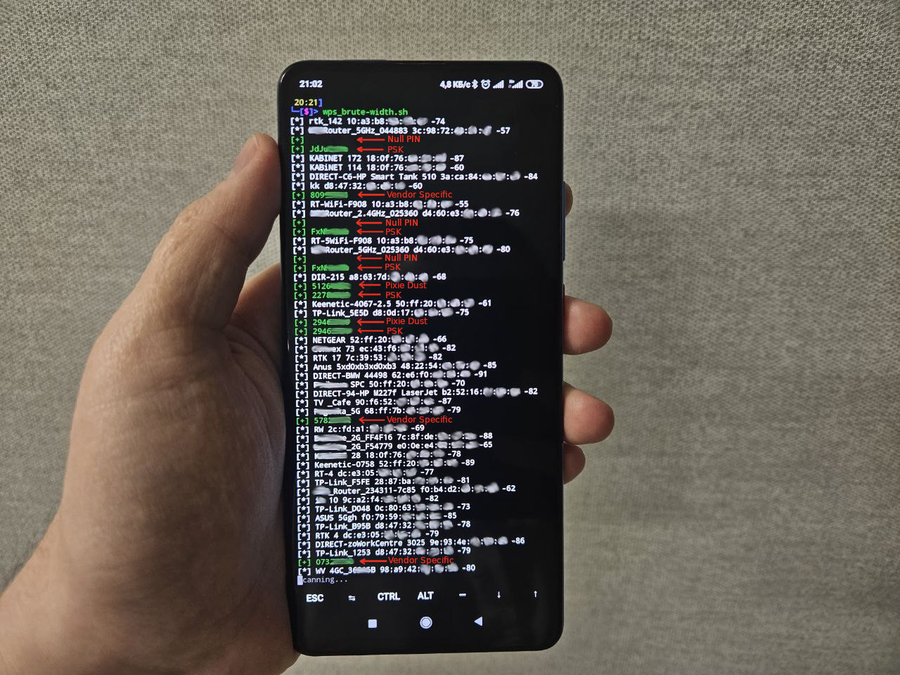

## wpa_brute.sh

Online bruteforce WPA PSK using `wpa_supplicant`. Supports multi threading.

For example 4 threads of online bruteforcing:

## wpa_brute-width.sh

Online bruteforce WPA PSK using `wpa_supplicant` for all available WPA PSK networks.

For example use two weak passwords for all wireless networks:

## auth.py

Pure scapy implementation of `EAPOL` authentication

Response to wrong password:

Response to the correct password:

## brute.py

Online bruteforce WPA PSK using `scapy`. Supports multi threading.

## wps_brute.sh

WPS full PIN enumeration with `wpa_supplicant` on every wireless network card and without monitor mode.

## wps_brute-width.sh

Fast WPS attacks (`Pixie Dust`, `Vendor Specific`, `Null PIN`) with `wpa_supplicant` without monitor mode.

